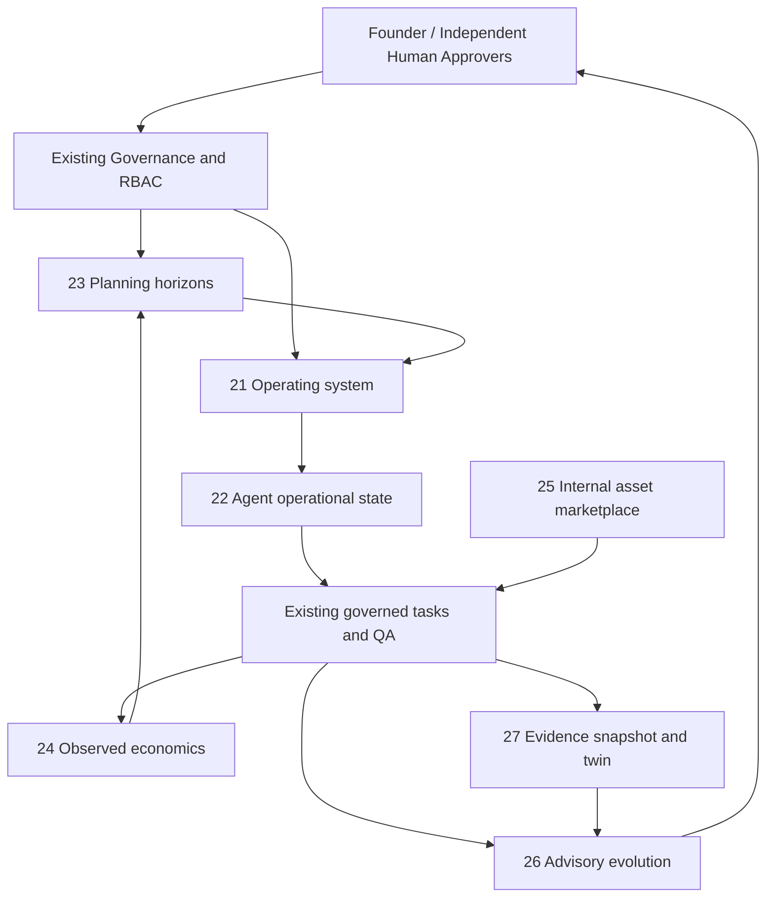

# AGO Sections 21–27 — Operating Contracts and Integration Design

**Status: architecture/design document; not executable implementation acceptance.** Derived from original V2 prompt (Library `Pasted markdown (2).md`) and the 1–34 master checklist. Frozen full acceptance is `docs/SECTIONS21_27_SCOPE.md`. Do not modify or override earlier architecture, BDR, Section 29 Constitution or Section 20 DNA.

## Cross-cutting integration



**Source of authority:** signed-session actor, persisted tenant/role grants, existing approval IDs and independent QA. Agent-produced text and apparent CEO names are not authorization. Decisions are scoped by tenant and target entity. Read APIs never grant capabilities. Execution always uses existing task/approval runtime. Store monetary expenses separately from virtual credits.

### Shared invariants
- Tenant-scoped UUID references for company/department/employee/plan/snapshot/asset.
- Explicit `actor_id` from authenticated session and immutable revision/time/provenance for meaningful mutations.
- Repeatable operations require idempotency key and optimistic revision or row lock; safe failure on duplicate/conflict.
- Audit every privileged transition; never allow source text, result payload or simulation to alter role grants or constitution.
- Operator migrations are additive and manual. Preserve all M1–M12 APIs and SQL migrations 001–023.
- Screen is a view of persisted facts: no hardcoded fake employee progress, cost, ROI or forecast confidence.

## 21. Organizational Operating System

**Modes:** `active`, `maintenance`, `emergency`, `paused`, `suspended`. Effective restrictions have least-privilege intersection of tenant mode, department mode, worker availability, task authorization, budget and approved DNA. Mode changes are versioned, reasoned, optionally expiring and actor-audited; emergency mode can pause automation but **never overrides approvals**.

**Task handling:** `proposed -> waiting_approval -> ready -> running -> completed|failed` remains authoritative. An OOS scheduler does not rewrite historical tasks; it controls whether eligible workers can acquire new work. Safe worker controls are `idle`, `available`, `paused`, `sleeping`, `interrupted`, `unavailable`, `terminated` with legal, auditable transitions. In-flight attempts use leases, fencing tokens, retry budgets and idempotent reconciliation; failed/unapproved tasks never restart unaudited.

**Allocation:** candidate prerequisites complete + independent QA pass, required permissions, employee/department capacities, available budget, deadlines and fair priority ordering. Use stable tie breakers; starvation tracking and escalation. Capacity exhaustion yields a recorded `blocked` diagnosis rather than a silent drop.

**Hiring/promotion/removal:** proposal -> exact human approval -> guarded execution -> independent evidence review -> compensation or operator recovery. Termination revokes future assignments and scoped tool access, preserves audit/QA history and never deletes past employee records or historical performance. Department deletion must check nonempty assignments, knowledge ownership and retention requirements.

**Acceptance:** integrated pause/resume/recovery test, resource contention and fairness, rejected self-approval, cross-tenant employee ID, emergency fail-closed, duplicate events, invalid transitions, retained history.

## 22. Agent State Model — operational, not consciousness

A snapshot is a timestamped operational record:
```text
employee_id, tenant_id, role, department_id, manager_id
current_task_ids, future_task_ids, active_goals, dependency_blockers
known_skill_evidence, knowledge_refs, confidence_band, confidence_source
workload_units, available_units, availability, overload_indicator
permission_refs, tool_scope, risk_flags, help_requested, escalation_target
learning_refs, source_revision, observed_at, ttl, evidence_digest
```

Do not pretend inferred stress represents a biological/psychological emotion; label as `operational_load`. Unknown/insufficient evidence is `null` not zero. Confidence comes from explicit model self-report + calibrated task-level success evidence (when available); never a permission to bypass QA. Each snapshot links to real workload and task references, not subjective machine experience.

State refresh after task assignment, budget denial, QA verdict, employee availability and observed model failure. Help escalation can pause scheduling and request a separate human/manager decision; cannot create higher privilege. Log sealed transitions and stale-data warnings.

**Acceptance:** correct tenancy, reproducible derived load, stale evidence handling, invalid manager reference rejection, overload refusal and safe escalation with no new grants.

## 23. Multi-Level Planning Engine

Horizon taxonomy: `lifetime > five_year > annual > quarterly > monthly > weekly > daily > hourly > current_task`. A child inherits exactly one parent for traceability, may contribute to several goals through explicit versioned references and must stay within parent time/budget bounds. The original M3 plan DAG and human review remain authoritative.

Workflow:
1. Founder defines lifetime/five-year vision and human reviews significant strategic objectives.
2. Planner proposes time-bounded child plans; no automatic activation without the existing approval contract.
3. On activation, eligible leaf steps become *proposed* tasks (M3); M2 must independently approve execution.
4. Real task+QA outcomes feed a read-only roll-up with missing-data flags.
5. Budget/deadline/dependency conflicts trigger a revision **proposal**, not silent mutation.

**Acceptance:** 9 horizon levels, parent bounds, DAG acyclicity, prerequisite QA, no child approved by plan approval alone, actual feedback and safe replan under budget/calendar limits.

## 24. Organizational Economics

Use two ledgers:
- **Internal quota:** existing virtual-credit balance/charges, not money.
- **Observed financial evidence:** provider invoice/usage token, storage metering, tool bill, compute time and currency with verified period/provider/source, no amount inferred from chat text. Import must be idempotent with a source reference and provenance; mark unverified entries explicitly.

Roll up tenant -> department -> employee/project. Every child spending limit <= parent remaining envelope; transactions cannot race to overspend. Estimated opportunity cost and ROI require declared baselines and uncertainty: never label a synthetic model result an observed profit. Proposed optimization must maintain QA, RBAC, Constitution and prior approvals.

**Acceptance:** real evidence import only if provider record exists; currency/period guard; negative duplicate, forged invoice, cross-tenant, overbudget and ROI-without-observations tests. Real invoice+revenue reconciliation operationally blocked until operator supplies actual data/provider permissions.

## 25. Internal Marketplace

An asset record needs: tenant, owner department, publisher, type, semver, immutable content digest, visibility, license, source/evidence refs, dependency/compatibility manifest, status and timestamps. Types include service, library, dataset, research, design system, template, AI agent, model and workflow.

Lifecycle: `draft -> proposed -> reviewed -> published -> deprecated -> revoked`. Draft/review/publish cannot grant external execution permissions. Cross-department consumption writes an auditable authorized use record tied to immutable version and existing tool/agent permission checks. Deleting publisher does not destroy consumed provenance. Paid distribution is out of scope without approval and verified billing.

**Acceptance:** existing-tenant visibility, stable versioning, immutable published payload, denial of cross-tenant read, independent approval, revoke stops new use, existing history retains evidence.

## 26. Autonomous Evolution Engine — strictly advisory

Collect observed task/QA/retries, architecture violations, latency, budget, prompt evaluations, department throughput, defect escape and evidence quality. Every proposed improvement links:
```text
metric baseline, candidate change, expected effect, measurement window,
sample size, possible confounders, evidence digests, approval IDs,
promotion gate, rollback plan, observed after-evidence, reviewer decision
```
Use the existing MetaBrain recommendation and independent reviewed-evaluation mechanisms as primary authority; do not create a second unsafe approval engine. Code/prompt/policy changes remain proposals until separately authorized and exercised through normal release controls. A negative outcome is preserved, never rewritten.

**Acceptance:** deterministic reproducible comparison, independent review, tamper detection, no automatic execution, no self-review, no false causal attribution.

## 27. Digital Twin

Read-only sandbox built from **immutable snapshot ID** and source digest, not mutable live tables during the scenario. Model employee availability, department capacities, projects/tasks, deadlines, costs, budgets, revenue evidence, market assumptions, hiring/layoffs and failure rates as explicitly hypothetical dimensions.

Outputs include `baseline`, `scenario`, `delta`, `assumptions`, `data_coverage`, `uncertainty`, `snapshot_age` and `limitations`. Scenario compute must have bounded iteration/time/resources, stable seeds and input limits. It cannot call live CRUD, make personnel actions, create repository, charge provider or change governance.

Reconciliation compares subsequent observed outcomes to saved predictions, using out-of-sample errors and confidence intervals where enough evidence exists. A simulation with no observations must report `uncalibrated`, not guaranteed accurate.

**Acceptance:** full tenant isolation, snapshots integrity, stale-data warning, deterministic what-if, bounded counterfactuals, verified calibration evidence, no production writes or approval bypass.

## API and persistence direction (design, not yet deployed)

Prefer additive tables under the existing `deploy/sql` migration chain:
- OOS mode/worker state transition journal, scheduling/assignment reservations.
- Versioned agent operational snapshots with evidence.
- Horizon plans and immutable lineage/revision/QA rollups.
- Source-verified cost records, nested budget envelopes.
- Internal marketplace asset versions, access authorizations, consumption journal.
- Evidence-linked candidate experiment results via existing MetaBrain.
- Twin snapshots, scenarios and later calibration outcomes.

All tables must have tenant-qualified FKs and appropriate indexes. Repositories use existing request-scoped connection/typed ports; APIs use existing signed-session authentication, persisted RBAC and safe error envelopes; presenters consume these APIs. Independently reviewed consequential changes use the existing approvals table. Do not introduce a second database, independent microservice or auto-run scheduler until authorized.

## Operational dependencies and completion boundaries

- Founder-local PostgreSQL migration/update and manual UAT not executed remotely.
- Real financial invoices/revenue and cloud model provider metrics need actual provider evidence and access; do not synthesize.
- Human signatures/independent QA for consequential organizational changes cannot be simulated by AI accounts.
- The original generated blueprint missing from repo/Library prevents certifying exact Section 15,17,18 authored-chapter parity.
- **This specification is ready for implementation, but no Section 21–27 checkbox is advanced by documentation alone.**
