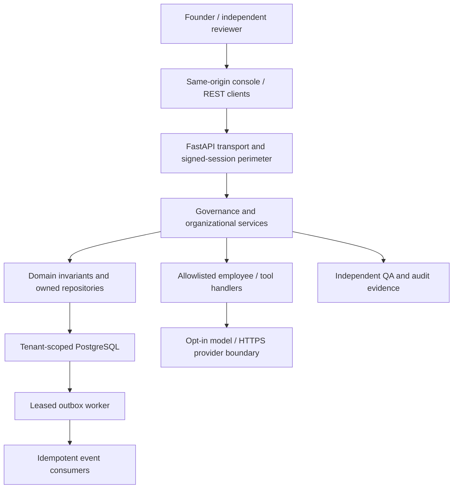

# Section 1 — Overall System Architecture

## Scope, provenance and frozen acceptance

This is the implementation-backed description of the existing AGO system,
not a replacement for the missing original V1–V3 blueprint. Source: founder's
`AGO_Architecture_Sections_01_34_Master_Checklist.md`, Section 1 (read
2026-10-10); baseline `96988de`. The seven gates below are the full bounded
Section 1 scope. Changes to the system described here require the standing
BDR rule and Section 14 dependency contract. This chapter does not implement
missing features owned by other sections.

| Gate | Acceptance artifact / executable evidence |
|---|---|
| S1-01 Describe presentation, application, domain, infrastructure and shared layers | Layer mapping below; versioned module policy and Section 14 guard |
| S1-02 Define responsibilities and boundaries for every organizational module | Context catalog, complete source-linked module inventory, future subsystem boundary table |
| S1-03 Define dependency direction and forbidden cross-layer coupling | Existing Section 14 allowlist, layer matrix, cycle and SQL ownership checks |
| S1-04 Implement a backend-to-database request path | Existing `test_complete_http_approval_task_review_lifecycle` against disposable PostgreSQL |
| S1-05 Define synchronous API versus asynchronous command/event flows | Communication/transaction rules below; leased outbox tests |
| S1-06 Map goal → plan → approval → execution → QA → audit | Lifecycle below; existing strategic plan, HTTP governance and agent integration tests |
| S1-07 Document fault containment, scaling and organizational tenancy | Failure matrix and deployment/tenancy limits below; isolation and readiness tests |

## System boundary and deployed shape

AGO currently runs as one Python/FastAPI modular monolith with a same-origin
HTML/JavaScript console and PostgreSQL. Separately invoked CLI processes
perform migration, operator provisioning, backup/restore and outbox dispatch.
They share reviewed contracts; a separate process is not a separate microservice.
Human founder/reviewer accounts and AI employees have different identities and
permissions. Human authority enters through signed sessions and reviewed
approvals, not through model-generated statements.

An arrow is a permitted interaction, not a promise of automatic autonomous
progress. Workers and handlers require explicit operator/application wiring.
The optional provider boundary is disabled by default. Redis, Neo4j, vector
storage, object storage, a marketplace and distributed workflow orchestration
are future section deliverables, not current dependencies.

## Layers and dependency direction

The source of enforceable truth is `apps/backend/ago/architecture_policy.json`.
It records each Python module once, with its context, layer and exact permitted
imports. The companion generated `SECTION_01_MODULE_INVENTORY.md` lists every
module and actual import edge without inventing a new ownership system.

| Architectural concern | Existing registered layer | Responsibility |
|---|---|---|
| Presentation | transport, console assets | HTTP validation, session extraction, response serialization, browser views |
| Application | service | Coordinate domain operations and owned repositories, execute approved bounded handlers |
| Domain | domain | Goals, approvals, task transitions, credits, organization and QA invariants |
| Infrastructure | persistence; composition | PostgreSQL adapters, app assembly, CLI adapters, runtime release perimeter |
| Shared | foundation | Configuration, DI, logging, events, contracts, metrics, readiness and scheduling primitives |

Composition may assemble all layers. Transport may use service, persistence,
domain and foundation. Service may use persistence, domain and foundation.
Persistence may use domain and foundation. Domain may use domain/foundation.
Foundation may use foundation/domain. This describes the reviewed existing
matrix, including transport-to-repository access; it does not falsely claim a
completed ports-and-adapters refactor (Section 5).

Every actual import must be listed; unused permissions are violations.
Unregistered modules, cycles, higher-layer dependencies, unreviewable dynamic
imports and unauthorized writes to approval/QA tables fail the guard. Temporary
exceptions need independent review, tracked rationale and expiry. Section 14
owns the enforcement implementation and exception procedure.

## Organizational responsibilities and integration boundaries

| Context | Responsibility / owner | Published interaction |
|---|---|---|
| entrypoints | Application assembly and operator commands | `main`, migration/worker, provisioning and release CLIs; no independent authority grant |
| transport | REST and first-party console | `/v1` organization/governance/tasks/memory; brain, agents, insights, operations, knowledge, council, meta, tools, console routers |
| governance | Identity, session/RBAC, human decisions, council approvals, independent QA, audit | Signed principal + tenant; approval/task-review repositories; never trust a caller-supplied authorization flag |
| strategy | Company Brain goals/plans, Meta Brain advice, DNA thresholds, experiments and digital-twin scenarios | Approved plan materialization; advisory proposals; no automatic code/policy mutation |
| workforce | Departments/employees, task states, approved handler execution | Task-bound single-use runs; prerequisite QA; allowlisted handlers; explicit provider budget |
| knowledge | Private memory and evidence-reviewed knowledge graph | Tenant/private visibility and source evidence; no broad semantic RAG claim |
| operations | Calendar, handoffs, reviewed tool enrollment and bounded departmental triggers | Internal records and reviewed read-only tool contracts; no external messaging promise |
| economics | Virtual quotas, usage and operational scorecard | Idempotent usage ledger and scenario inputs; no real money or settlement |
| platform | Events/outbox, settings/DI, logs, readiness, scheduler, migrations | Versioned events; leased dispatch; health checks; in-process primitives |

Organizational concepts cross technical contexts deliberately: a department is
stored in workforce, uses operations for handoffs and has governance-controlled
permissions. Managers assign only within their granted scope. An employee
identity alone cannot authorize an action. QA owns review outcomes; governance
owns approval decisions. Strategy proposes work and workforce executes only
after applicable human authorization.

| Architecture subsystem | Current boundary / outstanding owner |
|---|---|
| Company Brain / multi-level planning | Strategy goals and plan DAG; extended horizons belong to Section 23 |
| Meta Brain / DNA / evolution | Strategy evidence/advisory and threshold versions; broader evolution belongs to Sections 19, 20, 26 |
| Council / Constitution / OOS | Council and task governance exist; complete constitutional enforcement and resource lifecycle belong to Sections 29, 21 |
| Departments / managers / AI employees | Workforce identities and governed tasks; persistent specialist lifecycle belongs to Sections 21, 22 |
| Workflow / execution / QA / audit | Workforce state and governance repositories; full durable BPM is outstanding under workflow scope |
| Memory / Knowledge Graph | Knowledge context; consolidation and full graph belong to Sections 9, 31 |
| Calendar / communications | Operations records and handoffs; enterprise temporal synchronization belongs to Section 30 |
| Economics / marketplace | Virtual economics exists; marketplace remains Section 25 future work |
| Analytics / digital twin / psychology | Scorecards and deterministic scenarios; full engines belong to Sections 33, 27, 32 |
| API ecosystem / infrastructure / security | Transport and platform/governance controls; extended ecosystem and deployment belong to Sections 34, 11, 10 |

## Synchronous and asynchronous communication

A synchronous REST request authenticates the signed session, derives the tenant
and permissions server-side, validates input, calls an owned service/repository,
and returns committed results or a bounded error. Query responses are scoped
to the principal; no user-provided tenant or role is a substitute for permission.
Connections/transactions are bounded by the repository operation; the monolith
has no implicit transaction spanning arbitrary contexts or HTTP requests.

The in-process `EventBus` is a convenience mechanism, not durable messaging.
The PostgreSQL outbox/inbox is the durable delivery boundary. Producer business
writes and outbox enqueue must share a transaction where atomic notification is
required. A worker claims a bounded batch under a lease; success acknowledges
only its owned lease, failure increments attempts, exhaustion is recorded and
expired leases are recoverable. Delivery is at least once; consumers require
idempotence/inbox deduplication. Never assume exactly-once external effects.

Commands request actions; they do not grant approval. Events describe committed
facts with identity, time, correlation and versioned payload semantics.
`EventRegistry` validates enrolled contracts when explicitly used; universal
registry enforcement across every producer is not claimed. Tenant-sensitive
consumers revalidate provenance and scope. HTTP success is not evidence that
an asynchronous consumer has completed. Dispatch cannot bypass task approval,
credit checks, QA or tool enrollment.

## End-to-end governed execution

1. Founder creates a tenant-scoped goal and plan; plan dependencies form a DAG.
2. A distinct authorized human approves strategic activation. The approved plan
   materializes tasks; strategic consent does not replace per-task authorization.
3. The assignee starts only an approved task. Unmet prerequisite QA prevents
   dependent execution. Cross-tenant references and revoked permissions fail.
4. An allowlisted AI/tool handler obtains a task-bound run and captures results,
   usage and evidence. Model text cannot expand permissions or grant approval.
5. Completion enters review; an independent authorized QA reviewer accepts or
   rejects it. Rejection does not silently become successful completion.
6. Approval decisions, state transitions and reviews retain attributable audit
   records. Tenant-scoped read paths expose evidence for council/advisory/reporting.

The regression suite proves the actual HTTP-to-PostgreSQL lifecycle, strategic
approval/prerequisite QA and governed employee execution separately. It does not
claim a new one-request autonomous whole-company workflow.

## Fault containment, tenancy and scale

| Fault / boundary | Current containment | Operational limit / scaling rule |
|---|---|---|
| Missing/unavailable PostgreSQL | Readiness is 503; liveness stays independent; errors redact details | Stop traffic on readiness failure; no claim of offline durable writes |
| Invalid identity / cross-tenant identifier | Server-derived principal and tenant predicates reject access | Shared PostgreSQL is logical isolation; dedicated database and universal RLS are not claimed |
| Unauthorized decision / QA self-review | Independent reviewers and protected repositories/DB rules | Mandatory GitHub reviewer settings remain external Section 14 operational control |
| Handler exception / cancellation | Failed run evidence or leased-event retry/expiry; single-use claims | No automatic distributed workflow resume claim |
| Duplicate delivery / stale lease | Inbox/idempotence and owned-lease acknowledgements | Consumers must handle side-effect reconciliation; no exactly-once provider claim |
| Optional external provider failure | Explicit enablement, bounded adapter/budget and evidence | Never retry consequential external effects without an idempotency contract |
| Process crash / overload | Durable committed PostgreSQL state, bounded batches, restartable CLI | Shared process/resources are a failure domain; no microservice isolation claim |
| Configuration/schema mismatch | Release preflight, checksum migrations and fail-closed readiness | Operator-controlled reviewed migrations; no auto-reset |

Tenant identity belongs in every private lookup/write and relationship check;
resource UUIDs are identifiers, not authorization. Reviewers cannot self-approve
or review their own execution. Internal virtual credits constrain usage but are
not invoices. Console sessions stay in tab memory; secrets/DSNs must not enter
architecture reports, browser state dumps or source control.

Scale the current monolith first with measured indexes, bounded queries and
connection/batch limits. Multiple API replicas require a review of process-local
rate limits, scheduler, event bus, DI state and handlers before traffic is added;
replication is not currently certified. Extract a service only using Section 14's
versioned API/event contracts, owner, tenant/auth semantics, idempotence,
timeouts, recovery and acceptance tests. Do not introduce a new database merely
to make this architecture chapter look distributed. Availability/load SLOs,
capacity certification and multi-region operations remain deployment work.

## Verification, maintenance and rollback

`python scripts/check_system_architecture.py` compares the full module inventory
to source and checks the runtime router roster, required architecture documents,
context coverage, layer coverage and the existing Section 14 contract. The
Section 1 tests deliberately remove routers and alter the inventory to prove
that drift fails. Broad authenticated perimeter coverage tests all registered
`/v1` operations without a credential against a database-free application.
Existing PostgreSQL tests provide positive integration and tenancy evidence.

CI executes this gate on both configured Python versions before migrations,
then the existing full integration, JavaScript, Docker, browser and restore
gates. A successful architecture gate does not alone satisfy the integration
gate. Acceptance evidence is recorded in `docs/reports/SECTION01_FINAL_ACCEPTANCE.md`.

No new production service, table, router or runtime dependency is introduced.
Rollback reverts this section's docs/tests/checker/CI invocation; Section 14 and
all application behavior remain intact. Regenerate the inventory only after a
reviewed module-policy change: `python scripts/check_system_architecture.py
--write-inventory`. A changed inventory cannot authorize a forbidden import.
