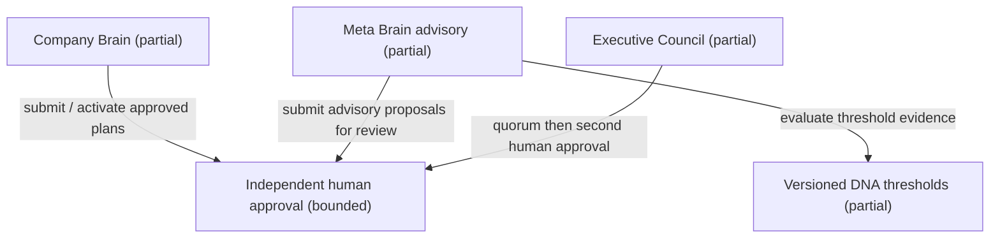
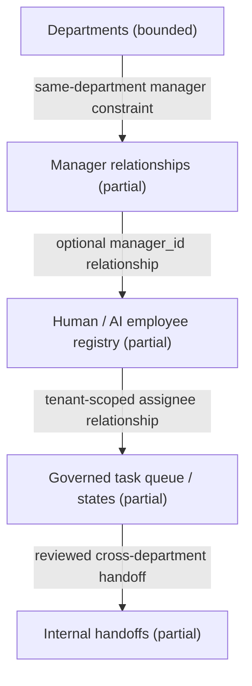
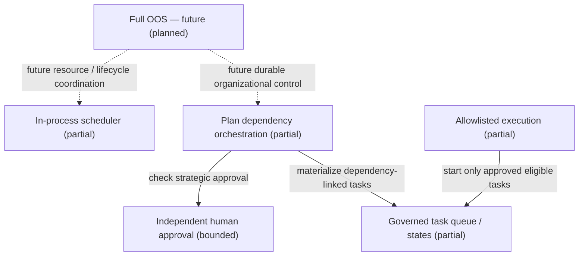
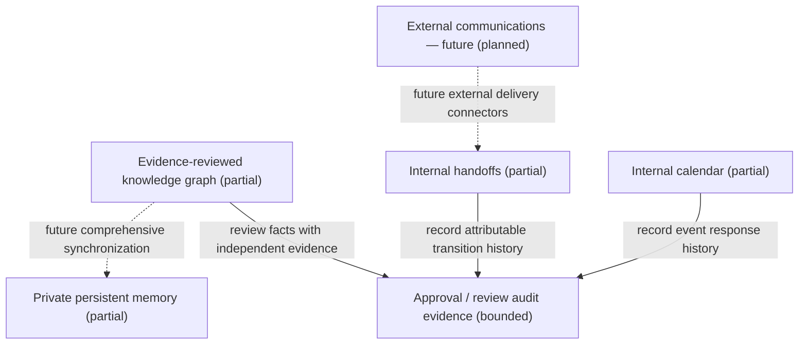
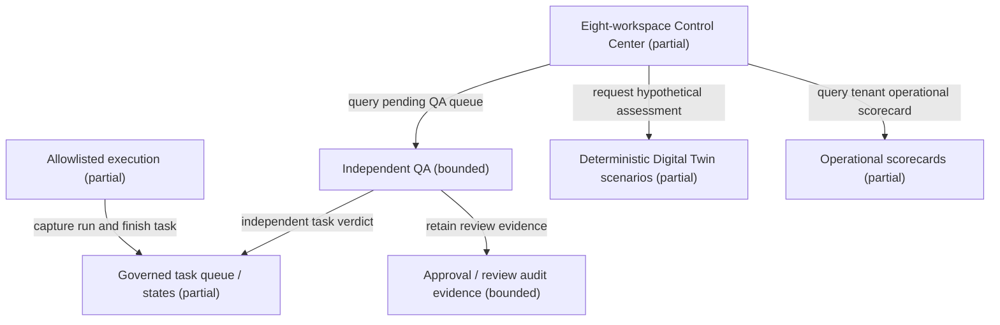
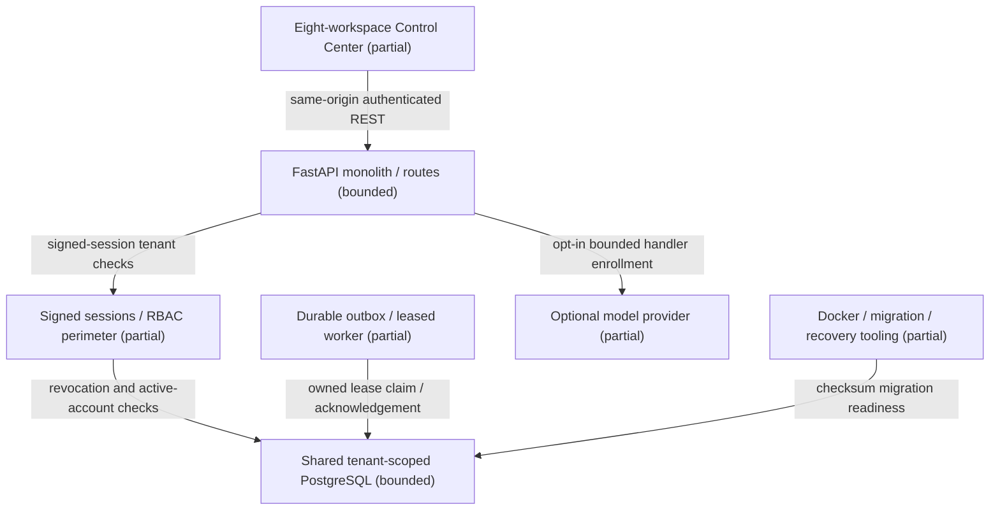

# Section 2 — Source-linked High-Level Component Views

Generated from `section02_components.json`; check with
`python scripts/check_component_diagrams.py`. Read the companion
`SECTION_02_HIGH_LEVEL_COMPONENT_DIAGRAM.md` for acceptance and boundaries.

**Legend:** bounded = existing narrow capability; partial = existing foundation
with broader scope outstanding; planned = absent target subsystem.
Solid arrows describe the labelled current relationship, supported by a
source symbol; dotted arrows describe a proposed interaction, never an
implemented call. Relationships can be queries, references or constraints:
these are not an import graph, deployment sequence or autonomous control loop.

## Component catalog

| Component | Capability status | Source symbols |
|---|---|---|
| Company Brain | partial | [GoalStore](../../apps/backend/ago/goals.py); [PlanExecution](../../apps/backend/ago/plan_execution.py) |
| Meta Brain advisory | partial | [MetaBrain.generate](../../apps/backend/ago/meta_brain.py) |
| Executive Council | partial | [CouncilStore.finalize](../../apps/backend/ago/council_store.py) |
| Independent human approval | bounded | [ApprovalRepository.decide](../../apps/backend/ago/governance.py) |
| Versioned DNA thresholds | partial | [GenomeStore](../../apps/backend/ago/organizational_dna.py) |
| Departments | bounded | [OrganizationStore.add_department](../../apps/backend/ago/organization_store.py) |
| Manager relationships | partial | [OrganizationStore.hire](../../apps/backend/ago/organization_store.py) |
| Human / AI employee registry | partial | [Employee](../../apps/backend/ago/organization.py) |
| Internal handoffs | partial | [HandoffStore.transition](../../apps/backend/ago/handoffs.py) |
| Governed task queue / states | partial | [TaskStore.authorize_and_start](../../apps/backend/ago/task_store.py) |
| Full OOS — future | planned | Future scope; no runtime implementation |
| In-process scheduler | partial | [IntervalScheduler](../../apps/backend/ago/scheduler.py) |
| Plan dependency orchestration | partial | [PlanExecution.materialize](../../apps/backend/ago/plan_execution.py) |
| Allowlisted execution | partial | [AgentRuntime.run](../../apps/backend/ago/agent_runtime.py) |
| Private persistent memory | partial | [MemoryStore](../../apps/backend/ago/organization_store.py) |
| Evidence-reviewed knowledge graph | partial | [KnowledgeStore.review](../../apps/backend/ago/knowledge_store.py) |
| Internal calendar | partial | [CalendarStore.respond](../../apps/backend/ago/calendar_store.py) |
| External communications — future | planned | Future scope; no runtime implementation |
| Independent QA | bounded | [QualityStore.review](../../apps/backend/ago/quality_store.py) |
| Approval / review audit evidence | bounded | [ApprovalRepository](../../apps/backend/ago/governance.py); [QualityStore](../../apps/backend/ago/quality_store.py) |
| Deterministic Digital Twin scenarios | partial | [ScenarioSimulator.estimate](../../apps/backend/ago/simulation.py) |
| Eight-workspace Control Center | partial | [register_console](../../apps/backend/ago/console_host.py) |
| Operational scorecards | partial | [Scorecard](../../apps/backend/ago/scorecard.py) |
| FastAPI monolith / routes | bounded | [create_app](../../apps/backend/ago/main.py) |
| Signed sessions / RBAC perimeter | partial | [authenticated](../../apps/backend/ago/api_m2.py); [install_release_perimeter](../../apps/backend/ago/release_security.py) |
| Shared tenant-scoped PostgreSQL | bounded | [db_connection](../../apps/backend/ago/api_m2.py) |
| Durable outbox / leased worker | partial | [EventWorker.run_once](../../apps/backend/ago/event_worker.py) |
| Optional model provider | partial | [ResponsesTextProvider](../../apps/backend/ago/model_provider.py) |
| Docker / migration / recovery tooling | partial | [schema_integrity](../../apps/backend/ago/release_security.py) |

## Company Brain, Meta Brain and Executive Council

| Relationship | Meaning | Evidence |
|---|---|---|
| brain → approval | submit / activate approved plans | [PlanExecution.activate](../../apps/backend/ago/plan_execution.py) |
| meta → approval | submit advisory proposals for review | [MetaBrain.generate](../../apps/backend/ago/meta_brain.py) |
| council → approval | quorum then second human approval | [CouncilStore.finalize](../../apps/backend/ago/council_store.py) |
| meta → dna | evaluate threshold evidence | [MetaBrain.generate](../../apps/backend/ago/meta_brain.py) |

## Departments, managers and employees

| Relationship | Meaning | Evidence |
|---|---|---|
| departments → managers | same-department manager constraint | [OrganizationStore.hire](../../apps/backend/ago/organization_store.py) |
| managers → employees | optional manager_id relationship | [OrganizationStore.hire](../../apps/backend/ago/organization_store.py) |
| employees → tasks | tenant-scoped assignee relationship | [TaskStore.propose](../../apps/backend/ago/task_store.py) |
| tasks → handoffs | reviewed cross-department handoff | [HandoffStore.request](../../apps/backend/ago/handoffs.py) |

## OOS, workflow engine and task queue

| Relationship | Meaning | Evidence |
|---|---|---|
| oos → scheduler | future resource / lifecycle coordination | Proposed; not implemented |
| oos → workflow | future durable organizational control | Proposed; not implemented |
| workflow → approval | check strategic approval | [PlanExecution.activate](../../apps/backend/ago/plan_execution.py) |
| workflow → tasks | materialize dependency-linked tasks | [PlanExecution.materialize](../../apps/backend/ago/plan_execution.py) |
| execution → tasks | start only approved eligible tasks | [AgentRuntime.run](../../apps/backend/ago/agent_runtime.py) |

## Memory, knowledge graph and communication

| Relationship | Meaning | Evidence |
|---|---|---|
| graph → audit | review facts with independent evidence | [KnowledgeStore.review](../../apps/backend/ago/knowledge_store.py) |
| handoffs → audit | record attributable transition history | [HandoffStore.history](../../apps/backend/ago/handoffs.py) |
| calendar → audit | record event response history | [CalendarStore.history](../../apps/backend/ago/calendar_store.py) |
| graph → memory | future comprehensive synchronization | Proposed; not implemented |
| communications → handoffs | future external delivery connectors | Proposed; not implemented |

## Execution, QA, audit, simulation and dashboards

| Relationship | Meaning | Evidence |
|---|---|---|
| execution → tasks | capture run and finish task | [AgentRuntime._execute](../../apps/backend/ago/agent_runtime.py) |
| qa → tasks | independent task verdict | [QualityStore.review](../../apps/backend/ago/quality_store.py) |
| qa → audit | retain review evidence | [QualityStore.review](../../apps/backend/ago/quality_store.py) |
| dashboard → qa | query pending QA queue | [pending_qa](../../apps/backend/ago/console_api.py) |
| dashboard → analytics | query tenant operational scorecard | [scorecard](../../apps/backend/ago/api_insights.py) |
| dashboard → twin | request hypothetical assessment | [simulate](../../apps/backend/ago/api_insights.py) |

## Infrastructure, stores and security boundaries

| Relationship | Meaning | Evidence |
|---|---|---|
| dashboard → api | same-origin authenticated REST | [create_app](../../apps/backend/ago/main.py) |
| api → security | signed-session tenant checks | [authenticated](../../apps/backend/ago/api_m2.py) |
| security → postgres | revocation and active-account checks | [authenticated](../../apps/backend/ago/api_m2.py) |
| outbox → postgres | owned lease claim / acknowledgement | [EventWorker.run_once](../../apps/backend/ago/event_worker.py) |
| api → provider | opt-in bounded handler enrollment | [optional_model_handlers](../../apps/backend/ago/model_handlers.py) |
| infrastructure → postgres | checksum migration readiness | [schema_integrity](../../apps/backend/ago/release_security.py) |
