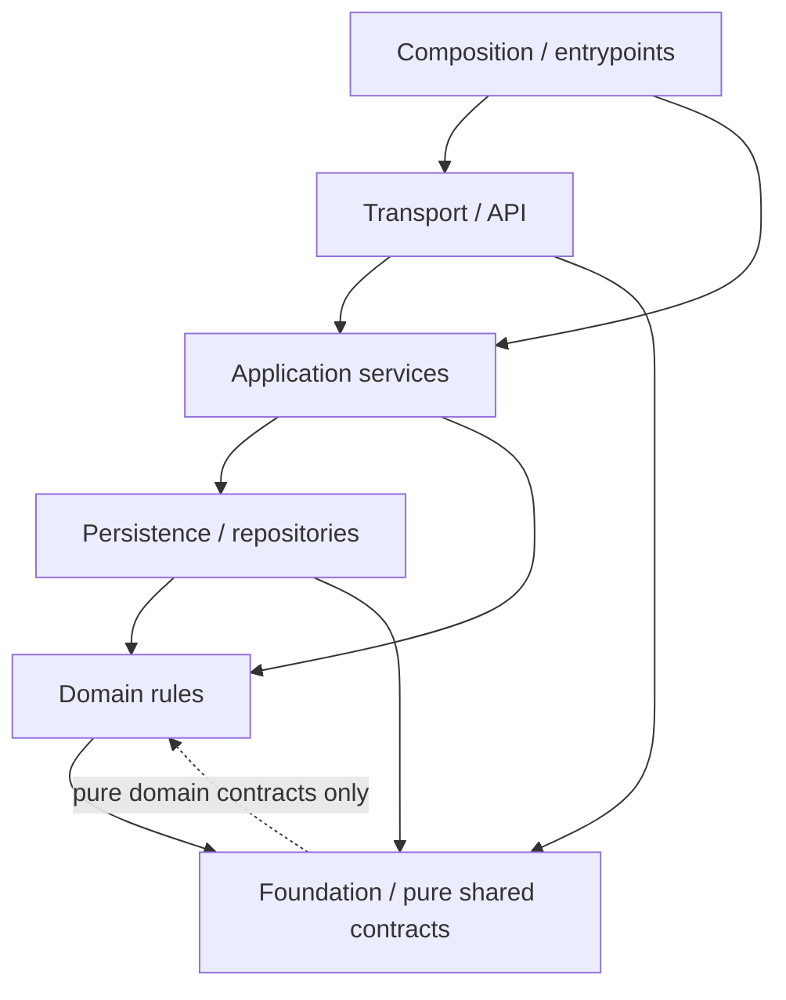

# AGO Section 14 — Module Dependency Rules and Enforceable Contracts

**Status:** Implemented as a strictly scoped modular-monolith architecture gate.
**Version:** 1.0; **branch:** `develop`; **change class:** architecture-controlled.
**Authoritative machine policy:** `apps/backend/ago/architecture_policy.json`.
**Enforcement:** `python -m ago.architecture_guard check` and CI on Python
3.11 and 3.14. Current test evidence must be recorded in the section closeout.

This implements **Section 14's modular boundaries**; it does not claim that
Sections 1–13 or 15–34, or the historical original 0–35 blueprint, are
implemented. Source inventory includes 76 root Python modules and 142
recorded internal import edges at the accepted pre-change baseline.
This project remains a governed **modular monolith first** (BDR);
neither a new fleet of microservices nor a new database is introduced.

## 1. Context and module ownership

Every root-level `ago/*.py` file is registered with one bounded-context
owner and one architectural layer. A new file without a declaration causes
a failed build. The policy is versioned, source-controlled and packaged
with the production Python distribution.

| Context | Exclusive responsibility | Example modules |
|---|---|---|
| Entry points | App composition, local provisioning, migrations and release operations | `main`, `bootstrap`, `local_ops`, `event_runtime` |
| Transport | Signed API / HTTP routing / same-origin UI hosting | `api_m2`, `api_brain`, `console_api`, `auth_api` |
| Governance | RBAC, independently authorized changes, human quality review and audit decisions | `governance`, `quality_store`, `security_controls` |
| Strategy | Goals, planning, Meta Brain, versioned DNA and bounded simulations | `goals`, `plan_store`, `meta_brain`, `organizational_dna` |
| Workforce | Employee/task registry, allowlisted executors, human/AI task lifecycle | `organization_store`, `agent_runtime`, `task_store` |
| Knowledge | Persistent scoped memory and human evidence review | `memory`, `knowledge_store` |
| Operations | Department handoffs, internal calendar and tenant tool governance | `handoffs`, `tool_runtime`, `department_automation` |
| Economics | Virtual credits and operational scorecard metrics | `credits`, `scorecard` |
| Platform | Outbox/inbox, provider limits, settings, readiness and infrastructure policies | `events`, `postgres_event_store`, `platform` |

**Ownership rule:** The entrypoint/transport layer coordinates work; it
cannot silently rewrite a module's business invariants. Domain-owned state
changes flow through domain/service/repository interfaces and remain
subject to server-side authorization and database constraints. Cross-tenant
access is never permitted merely because two modules can import one another.

## 2. Mandatory dependency direction



The compiled six-layer matrix in `architecture_policy.json` is the
literal authority; arrows above show typical paths, not an exhaustive
permission to import anything. **There are two consecutive approvals
for any import:** (a) its source layer must legally depend on the
destination layer and (b) the precise `source -> target` pair must
appear in the version-controlled approved-import roster or an active,
independently reviewed exception.

- Composition may import any registered layer to assemble the process.
- Transport may import transport/service/persistence/domain/foundation.
- Service may import service/persistence/domain/foundation, **never transport**.
- Persistence may import persistence/domain/foundation, **never transport**.
- Domain may import domain/foundation, **never service/transport/persistence**.
- Foundation may import foundation and narrowly scoped pure domain contracts;
  **never service/persistence/transport/composition**.
- Every circular import, self-import and unknown `ago.*` submodule is forbidden
  regardless of approval/waiver.
- Dynamic `importlib.import_module(variable)` and non-literal `__import__`
  are rejected because graph membership cannot be statically reviewed.
- A new root module must be registered explicitly before it can join the graph.

The approved baseline lists **existing** edges only; it is not a standing
permission to grow indiscriminately within a context.

## 3. Domain protections and forbidden write paths

Three high-value PostgreSQL tables have **static write-owner fences**:

| Protected table | Sole permitted Python direct-SQL writer |
|---|---|
| `ago_approval_requests` | `governance` repository |
| `ago_approval_audit` | `governance` repository |
| `ago_task_reviews` | `quality_store` repository |

The checker scans AST string-literal SQL for `INSERT INTO`, `UPDATE` and
`DELETE FROM`; writes in an API, frontend, arbitrary agent, metadata module
or a new SQL wrapper violate Section 14. Existing PostgreSQL append-only
and tenant FK/approval triggers remain authoritative. **A static scan
cannot prove dynamic SQL is safe**; permission-separated PostgreSQL
roles, transaction integration tests and human code review are still
required before public production.

Related invariants are preserved, not reimplemented here:
requester cannot approve their own operation, reviewer must be distinct,
QA cannot be faked by an executor, council votes do not activate policy,
unapproved tools cannot dispatch and tenant IDs must be checked by the
server/database. Module imports never grant access to protected records.

## 4. Contracts for a future bounded-context extraction

AGO currently uses **in-process module calls**, not an automatically
deployed RPC service mesh. A module cannot be extracted into a remote
service merely because it appears in a context diagram.

Any proposed extraction first receives a reviewed `ARCH-NNN` decision
covering these compulsory contracts:

**Synchronous business contract** — named context owner, method,
versioned request and response contract, signed caller identity and
tenant claims, declared RBAC permission, deterministic error taxonomy
(401 auth, 403 policy, 404 scoped missing, 409 conflicting state),
idempotency key for any mutation, observed request ID, bounded timeout,
cancellation, retries only for idempotent operations and private no-store
responses. Do not trust a client-provided tenant ID in place of session
authority.

**Asynchronous event contract** — immutable `event_id`, `tenant_id`,
`event_type`, `schema_version`, `occurred_at` (UTC offset aware),
`producer`, `correlation_id`, `causation_id`, `idempotency_key`,
`payload_hash`, `payload` and provenance/audit reference. Version the
schema with backward-compatible additive changes by default; reject
unknown mandatory fields, never silently infer permissions from events.

**Transactional authority** — only the owning context commits its
aggregate's invariants. Cross-context publication uses the **existing
transactional outbox/inbox**; consumers are idempotent. No shared remote
transaction or implicit cross-tenant batch. Audit trail and independent
human-review evidence must survive timeouts, retries and replays.

**Upgrade and rollback contract** — compatibility matrix for old and new
consumers, explicit schema migration sequence, rollback/forward-fix plan,
observability and deterministic integration tests. API/event versioning
and data residency/privacy require separate review before deployment.

These are architectural definitions, **not new external APIs or network
code** introduced by Section 14.

## 5. Reviewed exception / amendment process

Baseline policies and the checker are source-controlled and routed through
`.github/CODEOWNERS` for architecture owner review. However, GitHub CODEOWNERS
**is not itself a branch protection policy**; repository admins must
separately require approvals and successful checks to enforce review before
merge. No automatic or fictional approval is asserted.

A legitimate exceptional dependency requires all of:

1. A tracked `ARCH-NNN` or `ARCH-NNNNNNNN` change request stating the
   business reason, which context owns it, alternatives and rollback.
2. A source/target-specific entry in `exceptions`; no wildcards or
   whole-layer exemptions.
3. Authorship, distinct named reviewer, ISO review date and an expiry of
   at most **180 days**; already expired exceptions fail CI.
4. Passing cycle, layer-direction and protected-governance-write checks;
   **no exception may waive these**.
5. New security/contract/negative tests; removal of the exception and
   conversion to an explicitly revised policy baseline once reviewed.
6. The exception must be actually used; otherwise it fails as stale
   permission. Baseline edges that have disappeared also fail as stale.

Changing the permanent approved-import roster, context owner or layer
matrix requires an explicit architectural decision and review; code
authors may not quietly update the policy in an unrelated feature PR.
All history remains available in Git and code review.

## 6. Deterministic dependency graph and CI evidence

```bash
cd apps/backend
python -m ago.architecture_guard check
python -m ago.architecture_guard check --json --dot /tmp/ago-section14.dot
python -m pytest -q tests/test_section14_module_boundaries.py
```

The checker is read-only by default; `--dot` writes an optional Graphviz
diagram for review. It neither migrates a database, changes accounts nor
contacts model/network providers. It scans **all** root AGO Python modules
rather than a selective hand-picked subset and checks:

- module inventory vs policy (no unowned new/dangling files);
- AST imports, including function-local and literal dynamic imports;
- exact approved-import roster and six-layer direction;
- cycles and self-imports;
- direct SQL mutations to three high-impact protected tables;
- invalid, self-approved, expired, duplicate or unused exceptions.

GitHub's existing matrix must run this guard on both Python 3.11 and 3.14
alongside Ruff, pytest, Node, real Chromium, Docker and PostgreSQL recovery.
The guard's DOT artifact is retained for independent technical review.

### Exit acceptance and unresolved wider scope

Section 14's six checklist gates are **technically closed only after the
final CI run passes**. The pre-existing broader Sections 1–13/15–34
remain separately tracked in
`docs/ARCHITECTURE_STATUS_AND_BACKLOG.md`. There is no demand for a
new monorepo, new broker or premature microservice split in this section.

Section 14 source of truth: the committed policy + checker + tests + CI
status + documented human review requirements. The user retains the final
decision on architectural amendments and future project scope.
